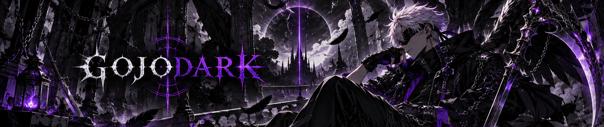

  

🎮 Games &nbsp;•&nbsp; 💻 Programação &nbsp;•&nbsp; ⚙️ Tecnologia

**Transformando ideias em projetos que eu realmente gostaria de usar.**

---

## 👤 Sobre mim

Sou **Victor**, também conhecido como **GojoDark**.

Curto **programação, tecnologia e games**, principalmente quando posso transformar uma ideia em algo que realmente funciona.

Grande parte dos meus projetos começa com uma pergunta simples:

> **“Isso seria útil... então por que não criar?”**

Atualmente desenvolvendo **VØIDCORE** e **Nightcall**.

---

## ⚙️ Tecnologias

  

---

## 🚀 Projetos

### 🎯 VØIDCORE

Plataforma de ferramentas e utilidades para jogadores de FPS.

**CS2 • VALORANT • Rainbow Six Siege**

`Sensibilidade` • `Crosshair` • `Configurações` • `Ferramentas para FPS`

➡️ **[Ver VØIDCORE](https://github.com/GojoDark/V-IDCORE)**

 

### 📡 Nightcall

Plataforma própria de comunicação para conversar, jogar e criar comunidades.

`Conversas` • `Amigos` • `Chamadas` • `Compartilhamento de tela` • `Comunidades`

➡️ **[Ver Nightcall](https://github.com/GojoDark/Nightcall)**

---

## 🎮 Interesses

`🎮 Games` &nbsp;
`💻 Programação` &nbsp;
`⚙️ Tecnologia` &nbsp;
`🎯 FPS`

`🤖 Inteligência Artificial` &nbsp;
`🔧 Modding` &nbsp;
`🌐 Desenvolvimento Web`

`🖥️ Hardware & Software` &nbsp;
`🛠️ Projetos próprios`

---

## GOJODARK

`GAMES // CODE // TECH`

**Criar. Testar. Quebrar. Melhorar.**

